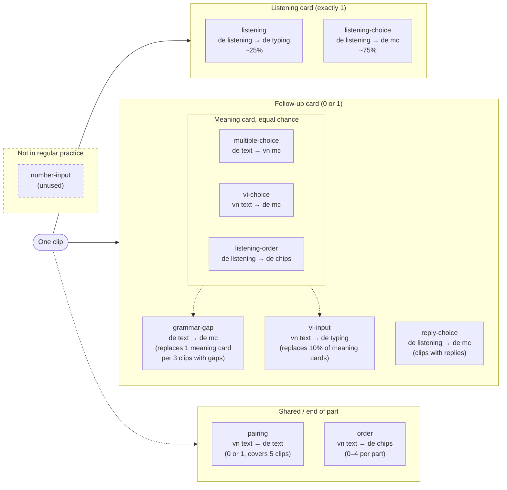
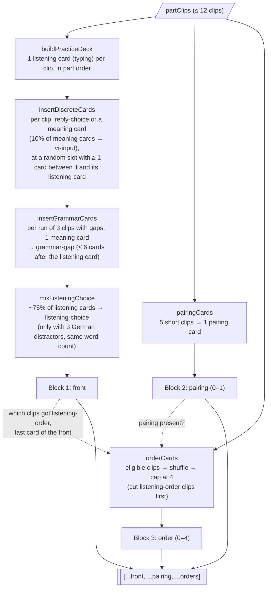
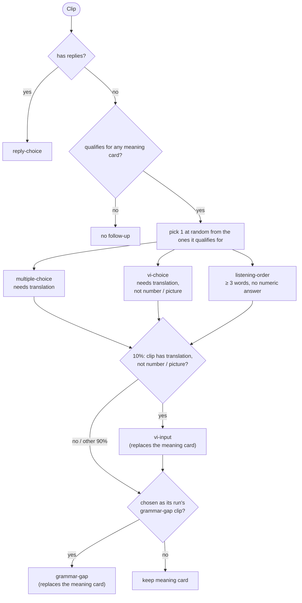
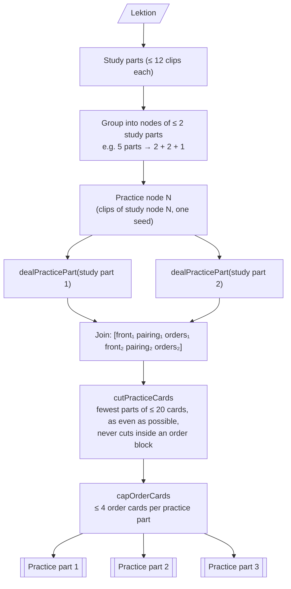

# Practice card types

Each kind is named as **question language + format → answer language + format**.

Source of the kind list: `src/lib/card-kinds.ts`, plus `reply-choice` and `number-input` in `src/lib/sentence-order.ts`. Regular practice decks are built in `src/lib/sentence-order.ts` and `src/lib/practice-deck.ts`.

| Kind | Pattern | What the student does | Where it is dealt |
|---|---|---|---|
| `listening` | de listening → de typing | Hears the German clip and types the German. Every clip gets one listening card. | Regular practice: about 25% of listening cards stay as typing (more when the part is short on German distractors). Duels, for clips with no translation or no other card. |
| `listening-choice` | de listening → de mc (practice), de listening → vn mc (duels) | Practice: hears the German clip and picks the German line they heard. Duels: hears the clip and picks the Vietnamese meaning ("Câu này nghĩa là gì?"). | Regular practice: about 75% of listening cards (`LISTENING_CHOICE_SHARE`) switch to this when enough German distractors exist. Duels: 60% of meaning-choice cards (`DUEL_LISTENING_CHOICE_SHARE`). |
| `listening-order` | de listening → de chips | Hears the German clip and taps shuffled German word chips into order, plus 1–3 distractor words. No Vietnamese is shown. | Regular practice, as one of the meaning cards. Lesson jump, duels. Not in Blitzrunde (no audio in class). Needs at least 3 words and no numeric answer. Needs no translation, and `noSentenceOrder` does not apply (`isListeningOrderEligible`). |
| `order` | vn text → de chips | Reads the Vietnamese and taps shuffled German word chips into order, plus 1–3 distractor words. | Regular practice (at most 4 per practice part, at the end), lesson jump, duels, Blitzrunde. Needs sentence order, a translation, at least 3 words, and no numeric answer (`hasOrderCard`). |
| `multiple-choice` | de text → vn mc | Reads the German and picks the Vietnamese meaning. | Regular practice (as one of the meaning cards), lesson jump, duels, Blitzrunde. |
| `vi-choice` | vn text → de mc | Reads the Vietnamese and picks the German sentence. | Same places as multiple choice. Practice and lesson jump skip it for number clips and picture words; Blitzrunde does not. |
| `vi-input` | vn text → de typing | Reads the Vietnamese and types the German. | Regular practice: 10% of meaning cards (`VI_INPUT_SHARE`) are swapped for this, so it adds no cards. Skipped for number clips and picture words. Duels and Blitzrunde. Not in lesson jump. |
| `pairing` | vn text → de text | Matches five Vietnamese lines to their five German lines. At most one per study part. | Regular practice, Blitzrunde. Not in duels or lesson jump. |
| `reply-choice` | de listening → de mc | Hears the other person's German line and picks a German reply ("Was sagst du?"). Same pattern string as practice `listening-choice`; the options are replies. | Regular practice, for Leben-in-Deutschland clips with `replies` (for example `src/data/living/nagelstudio.json`). Replaces that clip's meaning card. |
| `number-input` | de listening → de number | Would hear the clip and type the price or time. | **Unused.** Number clips are ordinary `listening` cards. |

| `grammar-gap` | de text → de mc | Reads the German line with one word blanked and picks the form that fills it. | Regular practice. Replaces one meaning card in each run of 3 clips with gaps (`GRAMMAR_CLIPS_PER_CARD`). |

In regular practice there is no **de listening → vn mc** card. After hearing the clip, the choice is German. Vietnamese choices only appear when the prompt is text (`de text → vn mc`). Duels are the exception: their `listening-choice` options are Vietnamese.

## Words used here

- **Listening card:** the one card per clip that plays its audio first: `listening` or `listening-choice` (`isAnchorKind`). Every other card for that clip comes after it.
- **Meaning card:** the clip's one follow-up card, picked at random with equal chance from the kinds it qualifies for: `multiple-choice`, `vi-choice`, `listening-order`. 10% of the time it is then swapped for `vi-input`.
- **Order card:** an `order` card (vn text → de chips).
- **Study part:** up to 12 clips, studied together (`MAX_STUDY_CLIPS`).
- **Practice part:** up to 20 cards, played in one round (`MAX_PRACTICE_CARDS`).

## Card kinds by role

What each kind is for in regular practice. Dashed boxes are not dealt in regular practice.



## How a study part is dealt

`dealPracticePart` in `src/lib/practice-deck.ts` runs these steps in order:



How one clip picks its follow-up card:



An example part of 6 clips (A–F). Each clip's follow-up lands after its listening card with at least one card in between, so the front block is interleaved. Here 5 clips qualify for an order card, so one is cut: D, because its meaning card was listening-order:

```text
Block 1 (front)                                                  Block 2   Block 3
A·lis  B·lis  A·mc  C·lis  B·gap  D·lis  C·vi  E·lis  D·lo  F·lis  E·mc  F·reply | pairing | C·ord  A·ord  E·ord  B·ord
```

`lis` = listening or listening-choice, `mc`/`vi`/`lo` = meaning card, `gap` = grammar gap, `ord` = order card.

The same three blocks in detail:

1. **Listening and meaning cards, mixed.**
   - **Exactly one** listening card per clip, in the part's order. Every clip starts as typing. About 75% then switch to de listening → de mc (`mixListeningChoice`). Only clips with 3 German distractors of the same word count can switch, so a part short on them keeps more typing cards.
   - **Zero or one** follow-up card per clip, at a random slot after its listening card:
     - If the clip has replies (Leben in Deutschland), a `reply-choice` card.
     - Otherwise a meaning card, picked at random from the ones the clip qualifies for: de text → vn mc, vn text → de mc, de listening → de chips. The two choice cards need a translation; vn text → de mc is skipped for number clips and picture words. Listening chips need at least 3 words and no numeric answer. If the clip qualifies for none, nothing is dealt.
     - 10% of the time (`VI_INPUT_SHARE`) the picked meaning card is swapped for vn text → de typing (`vi-input`), when the clip has a translation and is not a number clip or picture word. It takes the meaning card's place, so the count does not change.
     - Then, among clips with grammar gaps that got a meaning card, one meaning card per run of 3 such clips becomes a `grammar-gap` card (`insertGrammarCards`), placed within 6 cards after its listening card (`GRAMMAR_CARD_WINDOW`). The deck does not grow.
2. **Zero or one** pairing card (vn text → de text). Dealt when the part has five short clips (at most 3 German words each) with a translation and distinct German text. One card covers those five clips.
3. **Zero to four** order cards (vn text → de chips), shuffled, at the very end. When more than 4 clips qualify (`MAX_ORDER_CARDS`), 4 are kept at random. Clips whose meaning card is listening chips are cut first, so a student rarely builds the same sentence twice. Without a pairing card in between, the first order card is never the clip of the card just before it. A cut clip gets nothing in its place.

A clip is therefore one listening card, plus up to one meaning or reply card, plus maybe one order card. Pairing is shared. `number-input` is not part of this flow.

Outside trail nodes, one practice part is one `dealPracticePart` call, and `maxClipsPerPracticePart` picks a clip count that stays within 20 cards.

## Trail nodes

A Lektion's study parts are grouped into nodes of at most 2 study parts (`PARTS_PER_NODE`), as even as possible: 5 study parts become 2 + 2 + 1. Practice node N covers the clips of study node N.

`practiceNodeDecks` in `src/lib/practice-node.ts` deals each study part of the node with `dealPracticePart`, from one seed per node, and joins them. `cutPracticeCards` then cuts the cards into the fewest practice parts of at most 20 cards, as even as that allows, and never cuts inside a study part's block of order cards. Last, `capOrderCards` keeps at most 4 order cards in each practice part, which only matters when one part holds the order blocks of two small study parts.



On the current lessons this gives 2–3 practice parts per node, at most 19 cards per part.

A practice part's key is a hash of its card keys. Changing how cards are dealt changes those keys: a part saved only by its key then shows as not done until it is replayed.
